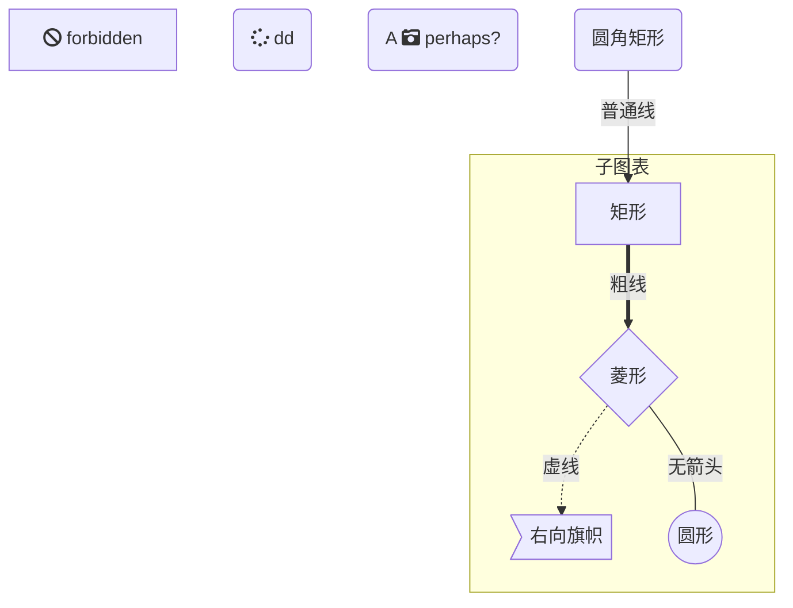
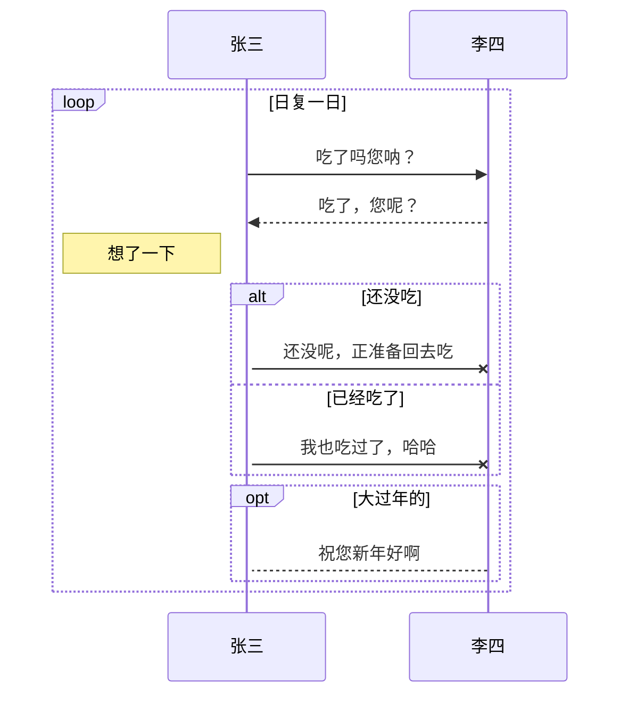
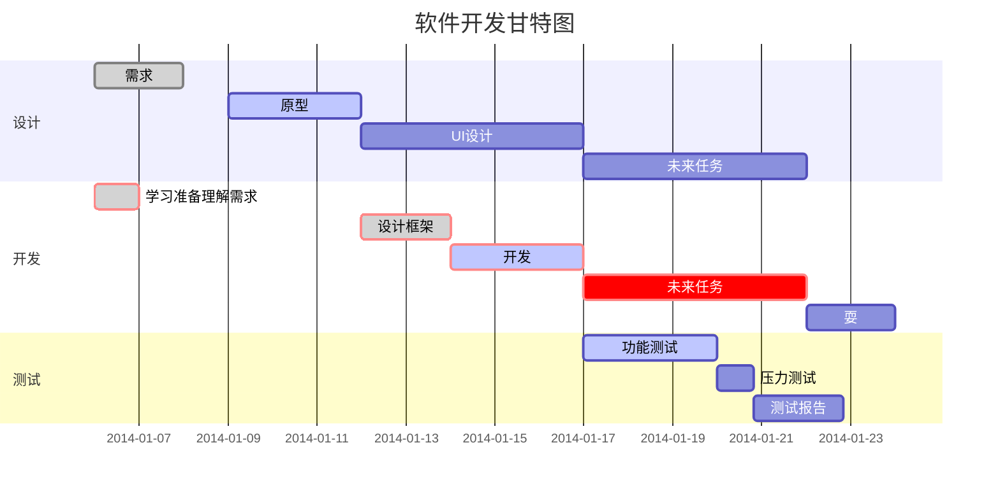

# Typora语法笔记

## ubuntu安装

```python

wget -qO - https://typora.io/linux/public-key.asc | sudo apt-key add -

# add Typora's repository
sudo add-apt-repository 'deb https://typora.io/linux ./'
sudo apt-get update

# install typora
sudo apt-get install typora
```

## Typora快捷键

|快捷键 	|作用|快捷键 |	作用|
|-|-|-|-|
|Ctrl+1 	|一阶标题 	|Ctrl+B 	|字体加粗|
|Ctrl+2 	|二阶标题 	|Ctrl+I 	|字体倾斜|
|Ctrl+3 	|三阶标题 	|Ctrl+U 	|下划线|
|Ctrl+4 	|四阶标题 	|Ctrl+Home 	|返回Typora顶部|
|Ctrl+5 	|五阶标题 	|Ctrl+End 	|返回Typora底部|
|Ctrl+6 	|六阶标题 	|Ctrl+T 	|创建表格|
|Ctrl+L 	|选中某句话 	|Ctrl+K 	|创建超链接|
|Ctrl+D 	|选中某个单词 	|Ctrl+F 	|搜索|
|Ctrl+E 	|选中相同格式的文字 	|Ctrl+H 	|搜索并替换|
|Alt+Shift+5 	|删除线 	|Ctrl+Shift+I 	|插入图片|
|Ctrl+Shift+M 	|公式块 	|Ctrl+Shift+Q 	|引用|

## 绘图

### Mermaid 

Mermaid 是一个用于画流程图、状态图、时序图、甘特图的库，使用 JS 进行本地渲染，广泛集成于许多 Markdown 编辑器中。

Mermaid 作为一个使用 JS 渲染的库，生成的不是一个“图片”，而是一段 HTML 代码，因此安全许多。

官网：https://mermaidjs.github.io/
Github 项目地址：https://github.com/knsv/mermaid

接下来开始记录 Mermaid 的流程图及序列图的语法，也就是大家在工作中常使用的图表。

其语法格式为:

```
​```mermaid
   mermaid语法段 
​```
```

#### 流程图

##### 图表方向

Mermaid 支持多种图表的方向，语法如下：

```
graph 方向描述
    图表中的其他语句...
```

方向描述关键字

| 用词 | TB       | BT       | LR       | LR       |
| ---- | -------- | -------- | -------- | -------- |
| 含义 | 从上至下 | 从下至上 | 从左至右 | 从右至左 |

##### 节点定义语法

即流程图中每个文本块，包括开始、结束、处理、判断等。Mermaid 中每个节点都有一个 id，以及节点的文字。id为内部使用标记，文本块为表现文字。

| 表述 | id[ text ] | id( text )   | id(( text )) | id> text ]   | id{ text } |
| ---- | ---------- | ------------ | ------------ | ------------ | ---------- |
| 说明 | 矩形节点   | 圆角矩形节点 | 圆形节点     | 左向旗子节点 | 菱形节点   |

**备注：**如果节点的文字中包含标点符号，需要时用双引号包裹起来。 如果希望在文字中使用换行，请使用 替换换行。

##### 节点间的连线

| 表述 | >        | -          | --   | --text--   | ==       | ==text==       | -.-  | -.text.-   |
| ---- | -------- | ---------- | ---- | ---------- | -------- | -------------- | ---- | ---------- |
| 说明 | 尾部箭头 | 尾部无箭头 | 单线 | 单线加文字 | 加粗线条 | 加粗线条加文字 | 虚线 | 虚线加文字 |

##### 子图表

使用以下语法添加子图表

```
subgraph 子图表名称
    子图表中的描述语句...
end
```

##### fontawesome（图标字体） 的支持

使用 `fa: #图表名称#` 的语法添加 fontawesome。

参考：http://www.fontawesome.com.cn/faicons/

##### 示例效果：



#### 序列图(时序图)

使用以下语法开始序列图

```
sequenceDiagram
    [参与者1][消息线][参与者2]:消息体
    ...
```

示例：

```
sequenceDiagram
    张三->>李四: 吃了吗？
    李四->>张三: 吃了
```

##### 参与者定义

上例中的张三、李四都是参与者，上例中的语法是最简单的，也可以明显表明参与者有哪些

```
sequenceDiagram
	participant 参与者 1
	participant 参与者 2
	...
	participant 简称 as 参与者 3 #该语法可以在接下来的描述中使用简称来代替参与者 3
```

##### 消息线

| 类型 | ->           | -->          | ->>          | -->>         | -x                         | --x                        |
| ---- | ------------ | ------------ | ------------ | ------------ | -------------------------- | -------------------------- |
| 描述 | 无箭头的实线 | 无箭头的虚线 | 有箭头的实线 | 有箭头的虚线 | 末端为叉的实线（表示异步） | 末端为叉的虚线（表示异步） |

##### 处理中

在消息线末尾增加 `+` ，则消息接收者进入当前消息的“处理中”状态； 
 在消息线末尾增加 `-` ，则消息接收者离开当前消息的“处理中”状态。

或者使用以下语法直接说明某个参与者进入“处理中”状态

```
activate 参与者
```

##### 标注

语法如下

```
Note 位置表述 参与者: 标注文字
```

其中位置表述可以为

| 表述 | right of | left of | over                       |
| ---- | -------- | ------- | -------------------------- |
| 含义 | 左侧     | 右侧    | 在当中，可以跨越多个参与者 |

##### 循环

语法如下

```
loop 循环的条件
    循环体描述语句
end
```

##### 判断

```
alt 条件 1 描述
    分支 1 描述语句
else 条件 2 描述 # else 分支可选
    分支 2 描述语句
else ...
    ...
end
```

如果遇到可选的情况，即没有 else 分支的情况，使用如下语法：

```
opt 条件描述
    分支描述语句
end
```
##### 代码示例：






### 时序图

#### 代码示例

```sequence
participant 小王 
participant 小李 
participant 小异常 
note left of 小王: 我是小王 
note over 小李: 我是小李 
note right of 小异常: 大家好！\n我是小异常 
小王->小王: 小王想：今天要去见两个好朋友咯~ 
小王->小李: 嘿，小李好久不见啊~ 
小李-->>小王: 是啊 
小李->小异常: 小异常，你好啊 
小异常-->小王: 哈，小王！\n最近身体怎么样了？ 
小王->>小异常: 还可以吧 
```


##### 关键字

　　1）title：表示该序列图中的标题。
　　2）participant：表示该序列图中的对象。
　　3）note：表示该序列图中的部分说明。关于note以下三种关键字：
​	* left of：表示在当前对象的左侧。
​	* right of：表示在当前对象的右侧。
​	* over：表示覆盖在当前对象的上方。
#### 箭头
　　1）->：实线实箭头
　　2）–>：虚线实箭头
　　3）->>：实线虚箭头
　　4）–>>：虚线虚箭头
#### 换行
如果当前行中的文字过多想要换行，可以使用 \n 进行转义换行，效果如以上例子。

### 流程图
#### 代码示例
``` flow
st=>start: 开始 
e=>end: 结束 
op=>operation: 操作（处理块） 
sub=>subroutine: 子程序 
cond=>condition: 是或者不是（条件判断）? 
cond2=>condition: 第二个判断（条件判断）? 
io=>inputoutput: 输出 

st->op
op->cond
cond(yes)->e
cond(no)->cond2
cond2(yes,right)->sub->op
cond2(no)->io->e
```
#### 关键字
　　1）start, end：表示该流程图中的开始与结束。
　　2）operation：表示该流程图中的处理块。
　　3）subroutine：表示该流程图中的子程序块。
　　4）condition：表示该流程图中的条件判断。
　　5）inputoutput：表示该流程图中的输入输出。
　　6）right, left：表示该流程图中当前模块下一个箭头的指向（默认箭头指向下方）。
　　7）yes, no：表示该流程图中条件判断的分支（默认yes箭头向下no箭头向右；yes与no可以和right同时使用；yes箭头向右时，no箭头向下）

#### 各模块之间的联系

##### 1）形式：

基本形式：

模块标识=>模块关键字: 模块模块名称
连接定义：
```
模块标识1->模块标识2
模块标识1->模块标识2->模块标识3
... ...
```
##### 2）说明：

通过模块与连接定义，可以组成一个完整的流程图。
在模块定义中，模块标识与模块名称可以自定义，模块关键字不可以自定义！

#### 注意事项
　　1）在进行连接的时候，可以通过right, left确定箭头的指向；
　　2）使用条件判断的连接时需要结合yes和no进行；
　　3）在连接各模块之间不能有空格，在模块标识关键字时也不能有空格。


