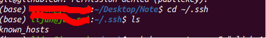
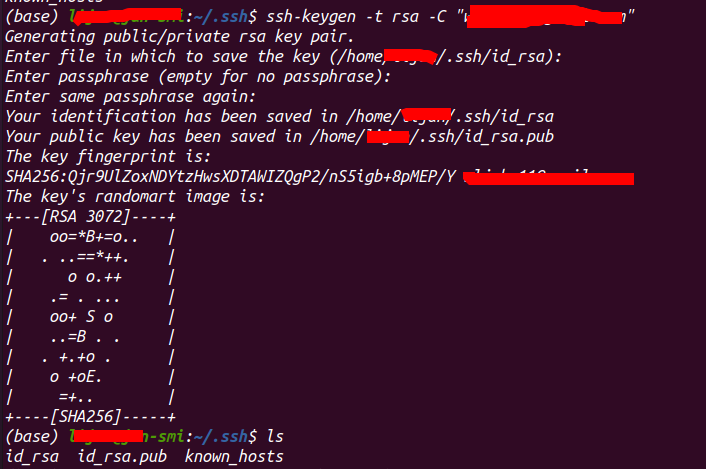

[toc]
# github 安装配置
### 1.github 安装
- `windows`下安装
  - 在Windows上使用Git，可以从Git官网直接下载安装程序，然后按默认选项安装即可。安装完成后，在开始菜单里找到“Git”->“Git Bash”，蹦出一个类似命令行窗口的东西，就说明Git安装成功！
- `Ubuntu` 安装教程
  - `sudo apt-get install git`
#### 2 安装SSH keys

<p style='color: red; font-size: 18'>在使用仓库之前，需要先安装SSH keys</p>

- 检查是否已井具有`ssh keys`

```bash
cd ~/.ssh
ls
```

- 创建 `ssh keys`
```bash
ssh-keygen -t rsa -C "你自己的github对应的邮箱地址"

# 注1：“”是必须的
# 注2：在ssh目录下进行的
```
运行过程中会提示输入文件名，可直接按回车或者输入`id_rsa`,并提示你输入两次密码（该密码是你push文件的时候要输入的密码，而不是github管理者的密码），或者直接按回车，不输入密码。那么push的时候就不需要输入密码，直接提交到github上了。

运行过程如下：


- 备份并移除已经存在的ssh keys(如果已存在ssh keys)

```bash
mkdir key_backup
cp id_rsa* key_backup
rm id_rsa*
# 即将已经存在的id_rsa，id_rsa.pub文件备份到key_backup文件夹
```


- 将刚刚创建的ssh keys添加到github中
  - 利用gedit/cat命令，查看id_rsa.pub的内容
..
- 检查SSH连接情况：
```bash
ssh -T git@github.com
```
    Hi 你的用户名! You’ve successfully authenticated, but GitHub does not provide shell access.

说明github上已有了SSH keys

**注1：之前在设置公钥时如果设置了密码，在该步骤会要求输入密码，那么，输入当时设置的密码即可；**

**注2：通过以上的设置之后，就能够通过SSH的方式，直接使用Git命令访问GitHub托管服务器了；**

**注3：若在服务器添加完公钥后报错。**
```bash
sign_and_send_pubkey: signing failed: agent refused operation
```
则需执行
```bash
eval "$(ssh-agent -s)"
ssh-add
```

### 3. 基础仓库
##### 3.1 *全局配置*：本机所有`git`仓库都使用该配置
```bash
$ git config --global user.name "Your Name"
$ git config --global user.email "email@example.com"
```
##### 3.2 *局部配置*：切换到仓库所在根目录，使得只有当前仓库使用该配置
```bash
$ git config user.name "Your name"
$ git config user.email "Your email"
```
配置完成之后可以通过`git config --list`查看所有的配置信息，或者只通过`git config user.name`查看当前用户信息，使用`git config user.email`查看邮箱信息

本地仓库初始化
cd ~/Document/dockerfiles
git init

 

对本地仓库进行更改（在 ～/Document/dockerfiles 目录下执行)
例如，添加一个Readme文件

touch Readme
1.
对刚刚的更改进行提交
该步不可省略！

git add Readme
git commit -m 'add readme file'
1.
2.
push
首先，需要将本地仓库与github仓库关联
注： https://github.com/你的github用户名/你的github仓库.git 是github上仓库的网址

git remote add origin https://github.com/你的github用户名/你的github仓库.git
1.
然后，push，此时，可能需要输入github账号和密码，按要求输入即可

git push origin master
1.
注：有时，在执行git push origin master时，报错：error:failed to push som refs to…….，那么，可以执行

git pull origin master
1.
 

如何推送本地内容到github上已有的仓库
从github上将该仓库clone下来
git clone https://github.com/你的github用户名/github仓库名.git
1.
 
对clone下来的仓库进行更改（在仓库目录下进行）
例如，添加一个新的文件

touch Readme_new
1.
 
对刚刚的更改进行提交
该步不可省略！(其实是提交到git缓存空间)

git add Readme_new
git commit -m 'add new readme file'
1.
2.
 

push
首先，需要将本地仓库与github仓库关联
注： https://github.com/你的github用户名/你的github仓库.git 是github上仓库的网址

git remote add origin https://github.com/你的github用户名/你的github仓库.git
1.
有时，会出现fatal: remote origin already exists.，那么，需要输入git remote rm origin 解决该问题

然后，push，此时，可能需要输入github账号和密码，按要求输入即可

git push origin master
1.
注：有时，在执行git push origin master时，报错：error:failed to push som refs to…….，那么，可以执行

git pull origin master
1.
至此，github上已有的仓库的便有了更新

如果需要添加文件夹，有一点需要注意：该文件夹不能为空！否则不能成功添加

操作命令小结
克隆github上已有的仓库
git clone https://github.com/你的github用户名/github仓库名.git
1.
 

或者是在github上新建仓库并且在本地新建同名的仓库
cd ~/Document/dockerfiles
git init
1.
2.
 

对本地仓库内容进行更改（如果是多次对本地的某个仓库进行这样的操作，直接从此步开始即可，不要前面的操作了，因为本地仓库已有具有了github仓库的.git文件了）

对更改内容进行提交

git add 更改文件名或者是文件夹名或者是点"."
git commit -m "commit内容标注"
1.
2.
 

本地仓库与github仓库关联
git remote add origin https://github.com/你的github用户名/你的github仓库.git
1.
 

push
git push origin master
1.
 

注：另外可能用到的命令

git remote rm origin
git pull origin master
1.
2.
查看当前git缓存空间状态
git status
-----------------------------------
ubuntu下安装及配置git的方法（最全超详细教程github）
https://blog.51cto.com/u_15242250/2856081
